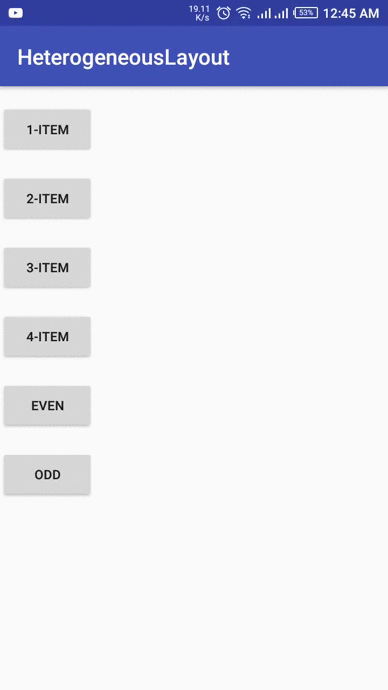

# HetrogenousLayout

💻 This Project is basically based on hetrogenous layout using StaggeredLayout. Dynamic Grids

# Conditions which Caterd in this Project

1). If you want to show the one Item according to your data size.  
2). If you want to show the two Item according to your data size.  
3). If you want to show the three Item according to your data size.  
4). If you want to show the even Item according to your data size.  
5). If you want to show the odd Item according to your data size. 

# Demo

# Licence
Copyright 2018 Danish Amjad

Licensed under the Apache License, Version 2.0 (the "License"); you may not use this file except in compliance with the License. You may obtain a copy of the License at

http://www.apache.org/licenses/LICENSE-2.0

Unless required by applicable law or agreed to in writing, software distributed under the License is distributed on an "AS IS" BASIS, WITHOUT WARRANTIES OR CONDITIONS OF ANY KIND, either express or implied. See the License for the specific language governing permissions and limitations under the License.
